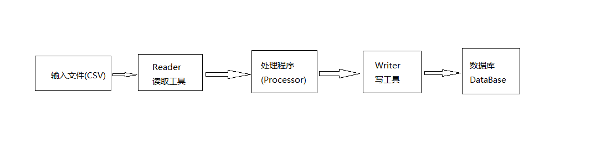
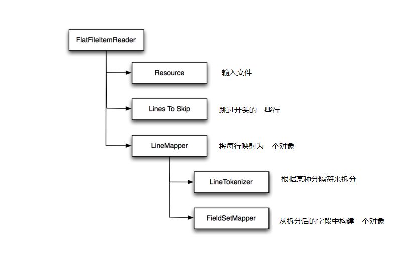
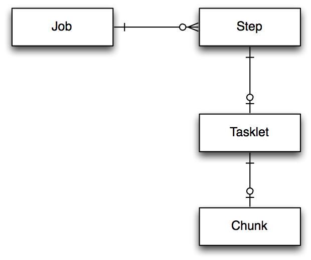

# 什么是SpringBatch?
一个轻量级的、全面批处理框架，是一个强大，高效处理大数据的批处理应用程序。

# SpringBatch特性？
Spring Batch提供可重用的功能,在处理大量的记录是至关重要的,包括日志记录、跟踪、事务管理、作业处理统计,工作重新启动,跳过和资源管理。它还提供了更先进的技术服务和功能,将使非常大容量,通过优化和高性能的批处理作业分区技术。简单和复杂、高容量的批处理作业可以利用框架高度可伸缩的方式来处理重要的信息。
1.Transaction management
2.Chunk based processing
3.Declarative I/O
4.Start/Stop/Restart
5.Retry/Skip
6.Web based administration interface (Spring Batch Admin)

# 对账系统使用SpringBatch目的
使用批处理程序来操作动态上GB的数据很可能会拖死整个系统，但现在我们可以通过Spring Batch将其拆解为多个小块（chunk）.Spring框架中的Spring Batch模块，是专门设计了用于对各种类型文件进行批处理的工程。

# SpringBatch原理
Spring Batch 有很多组成部分,我们先来看批量作业中的核心部分。 可以将一个作业分成以下3个步骤:

1. 读取数据
2. 对数据进行各种处理
3. 对数据进行写操作

例如, 打开一个CSV格式的数据文件,对文件中的数据执行某种处理,然后将数据写入数据库。 在Spring Batch中, 需要配置一个 reader 来读取文件中的数据(每次一行), 然后将数据传递给 processor 进行处理, 处理完成之后会将结果收集并分组为 “块 chunks” , 然后把这些记录发送给 writer ,在这里是插入到数据库中。 如图1所示。

**图1 Spring Batch批处理的基本逻辑**

Spring Batch 提供了常见输入源的 reader 实现, 极大地简化了批处理过程. 例如 CSV文件, XML文件、数据库、文件中的JSON记录,甚至是 JMS; 同样也实现了对应的 writer。 如有需要,创建自定义的 reader 和 writer 也很简单。

首先,让我们配置一个 file reader 来读取 CSV文件,将其内容映射到一个对象中,并将生成的对象插入数据库中。
## 读取并处理CVS文件 ##

Spring Batch 的内置 reader,  `org.springframework.batch.item.file.FlatFileItemReader`,用来将文件解析为多个独立的行。 需要纯文本文件的引用,文件开头要忽略的行数(比如标题,表头等信息), 以及将单行转换为对象的 `line mapper`. 行映射器需要一个分割字符串的分词器(line tokenizer),用来将一行拆分成多个组成字段, 还需要一个 field set mapper ,根据字段值构建对象。  `FlatFileItemReader` 的配置如下所示:

> **清单1 一个Spring Batch 配置文件**

<bean id="hfReader" class="org.springframework.batch.item.file.FlatFileItemReader" scope="step">
        <property name="resource" value="file:#{jobParameters['hfInputFile']}" />
        <!-- Skip the first line of the file because this is the header that defines the fields -->
        <property name="linesToSkip" value="0" />
        <!-- Defines how we map lines to objects -->
        <property name="lineMapper">
            <bean class="org.springframework.batch.item.file.mapping.DefaultLineMapper">
                <!-- The lineTokenizer divides individual lines up into units of work -->
                <property name="lineTokenizer">
                    <bean class="org.springframework.batch.item.file.transform.DelimitedLineTokenizer">
                    	<property name="delimiter" value="|"/>
                        <!-- Names of the CSV columns -->
                        <property name="names" value="payNumber,tradeDate,bizType,poundage,tradeAmount,rmb,date,status,text" />
                    </bean>
                </property>
                <!-- The fieldSetMapper maps a line in the file to a Product object -->
                <property name="fieldSetMapper">
                	<bean class="com.miz.recon.reader.HfFieldSetMapper"/>
                </property>
            </bean>
        </property>
    </bean>
    
    
**图2 FlatFileItemReader的组件**

**Resources:**  `resource` 属性指定了要读取的文件。 注释部分的 resource 使用了文件的相对路径,也就是批处理作业工作目录下的 `sample.csv` 。 有趣的是使用了Job参数 `InputFile` : 使用*job parameters* 则允许在运行时才根据需要决定相关参数。 在使用 import 文件的情况下, 在运行时才决定使用哪个参数比起在编译时就固定要灵活好用很多。 (要一遍又一遍,五六七八遍导入同一个文件是相当无聊的!)

**Lines to skip:**  属性`linesToSkip` 告诉 file reader 有多少标题行需要跳过。 通常CSV文件的第一行包含标题信息,如列名称,所以本例中让 reader 跳过文件的第一行。

**Line mapper:**   `lineMapper` 负责将一行记录转换为一个对象。 依赖两个组件:

- `LineTokenizer` 指定了如何将一行拆分为多个字段。 本例中列出了CSV文件中各列的列名。
- `fieldSetMapper` 根据字段值构造一个对象。 示例中构建了一个  `Product` 对象, 属性包括  id, name, description, 以及 quantity 。

请注意,虽然Spring Batch提供了基础框架, 但我们仍需要设置字段映射的逻辑。 清单2显示了 *HfCheckFile* 对象的源码,也就是我们准备构建的对象。

> **清单2 HfCheckFile.java**

public class HfCheckFile extends BaseEntity {

	/**
	 * 
	 */
	private static final long serialVersionUID = -4558356843803019234L;

    @Column
	private String payNumber;// 支付流水号

    @Column
    private Date tradeDate; //交易时间

	@Column
	private Long tradeAmount; // 交易金额
    
    @Column
    private Long poundage;//手续费
    
    @Column
	private HfTradeStatus status;	//交易状态
    
    @Column
    private Integer bizType;//业务类型(1:代收2:代付3:B2C代收)
    
    ......
    }
HfCheckFile 类是一个简单的POJO,包含6个字段。 清单3显示了 `HfFieldSetMapper` 类的源代码。

> **清单3 HfFieldSetMapper.java**
public class HfFieldSetMapper implements FieldSetMapper<HfCheckFile>{

	private static final Logger logger = LoggerFactory.getLogger(HfFieldSetMapper.class);

	@Override
	public HfCheckFile mapFieldSet(FieldSet fieldSet) throws BindException {
		try{

			HfCheckFile hfCheckFile = new HfCheckFile();
			hfCheckFile.setPayNumber(fieldSet.readString( "payNumber" ));
			String date = fieldSet.readString( "tradeDate");
			if(StringUtils.isNotBlank(date)){
				final SimpleDateFormat dateFormat = new SimpleDateFormat("yyyyMMdd");
				Date tradeDate;
				try {
					tradeDate = dateFormat.parse(date);
					hfCheckFile.setTradeDate(tradeDate);
				} catch (ParseException e) {
					e.printStackTrace();
				}
			}
			hfCheckFile.setTradeAmount(MoneyTransUtil.yuan2Fen(fieldSet.readBigDecimal("tradeAmount")));
			hfCheckFile.setPoundage(MoneyTransUtil.yuan2Fen(fieldSet.readBigDecimal("poundage")));
			hfCheckFile.setBizType(fieldSet.readInt("bizType"));
			Integer statusI = fieldSet.readInt("status");//交易状态(0:成功2:失败3:可疑
			if(statusI != null){
				if(statusI == 0){
					hfCheckFile.setStatus(HfTradeStatus.STATUS_SUCCESS);
				} else if(statusI == 2){
					hfCheckFile.setStatus(HfTradeStatus.STATUS_FAILED);
				} else if(statusI == 3){
					hfCheckFile.setStatus(HfTradeStatus.STATUS_QUES);
				}
			}
			return hfCheckFile;
		} catch (Exception e){
			logger.error("读取恒丰对账文件异常:" + e.getMessage());
			e.printStackTrace();
			return null;
		}

	}

}

`HfFieldSetMapper` 类实现了 `FieldSetMapper` 接口 ,该接口只定义了一个方法: `mapFieldSet()`.  只要 line mapper 将一行数据解析为单独的字段, 就会构建一个 `FieldSet`（包含命名好的字段), 然后将这个 `FieldSet` 对象传递给 `mapFieldSet()` 方法。 该方法负责创建对象来表示 CSV文件中的一行。 在本例中,我们通过 `FieldSet` 的各种 `read` 方法 构建一个 `HfCheckFile` 实例.

## 写入数据库 ##

在读取文件得到一组 `HfCheckFile` 之后 ,下一步就是将其写入到数据库。 原则上我们可以组装一个 processing  step,用来对这些数据进行某些业务处理,为简单起见,我们直接将数据写到数据库中。 清单4是 **HfCheckFileItemWriter** 类的源码。

> **清单4 `HfCheckFileItemWriter.java`**

public class HfCheckFileItemWriter implements ItemWriter<HfCheckFile> {

    @Autowired
    private JdbcTemplate jdbcTemplate;

    @Override
    public void write(List<? extends HfCheckFile> hfCheckFile_list) throws Exception {
    	try{
    		
    		StringBuffer sql = new StringBuffer();
    		sql.append("insert into hf_check_file (createDate,modifyDate,payNumber,tradeDate,bizType,tradeAmount,poundage,status) values ");
    		for( HfCheckFile hfCheckFile : hfCheckFile_list ) {
    			sql.append("(now(),now(),'" + hfCheckFile.getPayNumber() + "','" + DateTimeUtil.getDate(hfCheckFile.getTradeDate()) + "'," +  hfCheckFile.getBizType() + "," + hfCheckFile.getTradeAmount() + "," + hfCheckFile.getPoundage() + ",'" + hfCheckFile.getStatus() + "')");
    			sql.append(",");
    		}
    		sql.deleteCharAt(sql.length() - 1);
    		jdbcTemplate.update( sql.toString() );
    	} catch (Exception e){
    		e.printStackTrace();
    	}
    }
}

`HfCheckFileItemWriter` 类实现了  `ItemWriter` 接口, 该接口只有一个方法: `write()`.  方法`write()` 接受一个 **list**, 这里是 `List<? extends HfCheckFile> hfCheckFile_list` . Spring Batch 使用一种称为 “chunking” 的策略来实现 **writer** ,  chunking 的意思就是在读取时是一次读取一条数据, 但写入时是将一组数据一起执行的。 在job配置中,可以(通过 `commit-interval`)来控制每次想要一起写的item的数量。 在上面的例子中, `write()` 方法做了这些事:

**HfCheckFileItemWriter** 类使用了Spring的 `JdbcTemplate`  类,这是在  `applicationContext.xml` 文件中定义的, 通过自动装配机制注入到 **HfCheckFileItemWriter**  中。

## 用 spring-batch.xml 将上下文组装起来 ##

<?xml version="1.0" encoding="UTF-8"?>
<beans xmlns="http://www.springframework.org/schema/beans"
       xmlns:xsi="http://www.w3.org/2001/XMLSchema-instance"
       xsi:schemaLocation="http://www.springframework.org/schema/beans http://www.springframework.org/schema/beans/spring-beans-4.0.xsd">

    <bean id ="batchTransactionManager" class= "org.springframework.batch.support.transaction.ResourcelessTransactionManager" ></bean>

	<!-- Job Repository: used to persist the state of the batch job -->
    <bean id="jobRepository" class="org.springframework.batch.core.repository.support.MapJobRepositoryFactoryBean">
        <property name="transactionManager" ref="batchTransactionManager" />
    </bean>

    <bean id ="syncTaskExecutor" class= "org.springframework.core.task.SyncTaskExecutor" />

    <!-- Job Launcher: creates the job and the job state before launching it -->
    <bean id="jobLauncher" class="org.springframework.batch.core.launch.support.SimpleJobLauncher">
        <property name ="taskExecutor" ref= "syncTaskExecutor" />
        <property name="jobRepository" ref="jobRepository" />
    </bean>

<!-- 写入数据库 -->
    <bean id="hfCheckFileItemWriter" class="com.miz.recon.writer.HfCheckFileItemWriter" />
    <!-- 下载恒丰对账文件并解密 -->
    <bean id="downHfFileTasklet" class="com.miz.recon.tasklet.DownHfFileTasklet" scope="step">
        <property name="hfInputFile" value="#{jobParameters['hfInputFile']}" />
        <property name="date" value="#{jobParameters['date']}" />
    </bean>
    <!-- 读取支付系统交易记录并对账 -->
    <bean id="reconHfAndAlchemistTasklet" class="com.miz.recon.tasklet.ReconHfAndAlchemistTasklet" scope="step">
        <property name="date" value="#{jobParameters['date']}" />
    </bean>

    <job id="hfFileImportJob" xmlns="http://www.springframework.org/schema/batch">
        <step id="downHfFileStep" next="importHfFileStep">
            <tasklet ref="downHfFileTasklet" />
        </step>
        <step id="importHfFileStep" next="reconAlchemistStep">
            <tasklet >
                <chunk reader="hfReader" writer="hfCheckFileItemWriter" commit-interval="5" />
            </tasklet>
        </step>
        <step id="reconAlchemistStep">
            <tasklet ref="reconHfAndAlchemistTasklet" />
        </step>
    </job>
    
</beans>

- `jobRepository` : `MapJobRepositoryFactoryBean` 是 Spring Batch 用来管理 job 状态的组件。 在这里它使用前面配置的 `jdbctemplate` 将 job 信息储存到MySQL数据库中。

- `jobLauncher` : 该组件用来启动和管理 Spring Batch 作业的工作流,。

- `hfReader` : 在job中这个 bean 负责执行读操作。

- `hfCheckFileItemWriter` : 这个bean 负责将 `Product` 实例写入数据库。

> <u><h5>Spring Batch 中的 Lazy scope</h5></u>
>
> 你可能注意到 `hfReader` 的 `scope` 属性值为“`step`”。 **step scope** 是Spring框架中的一种作用域, 主要用于 Spring Batch。 它本质上是一种 *lazy scope*, Spring在首次访问时才创建这种 bean。 在本例中, 我们需要使用 step scope 是因为使用了 job 参数中的 "`InputFile`" 值, 这个值在应用启动时是不存在的。在 Spring Batch 中使用 step scope 使得在 Bean创建时能收到 "`InputFile`" 值。

请注意, 一个 `job` 可以包含 **0到多个** step; 一个 `step` 可以有 **0/1** 个 tasklet; 一个 `tasklet` 可以有 **0/1** 个 `chunk`, 如图3所示。
>**图3 job, step, tasklet 和 chunk 关系**

示例中, `hfFileImportJob` 包含一个名为 `importHfFileStep` 的 step。 `importHfFileStep` 包含一个未命名的 tasklet, 而tasklet中有一个 chunk。 chunk 引用了 `hfReader` 和 `hfCheckFileItemWriter` 。 同时指定 **commit-interval** 值为 `5` . 意思是每次最多传递给 writer 的记录数是5条。 该 step 使用 `hfReader` 读取5条产品记录，然后将这些记录传递给 `hfCheckFileItemWriter` 写出。 chunk 一直重复执行, 直到所有数据都处理完成。

